# Course Platform 系统架构文档

## 📋 目录

1. [系统概览](#1-系统概览)
2. [架构设计](#2-架构设计)
3. [微服务详解](#3-微服务详解)
4. [数据架构](#4-数据架构)
5. [通信机制](#5-通信机制)
6. [部署架构](#6-部署架构)
7. [安全架构](#7-安全架构)
8. [文件系统架构](#8-文件系统架构)
9. [配置管理](#9-配置管理)
10. [扩展性设计](#10-扩展性设计)

---

## 1. 系统概览

### 1.1 整体架构图

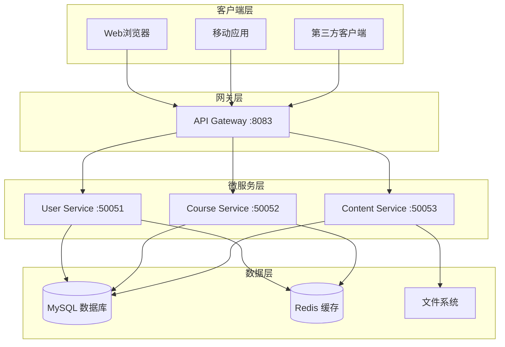

### 1.2 技术栈架构

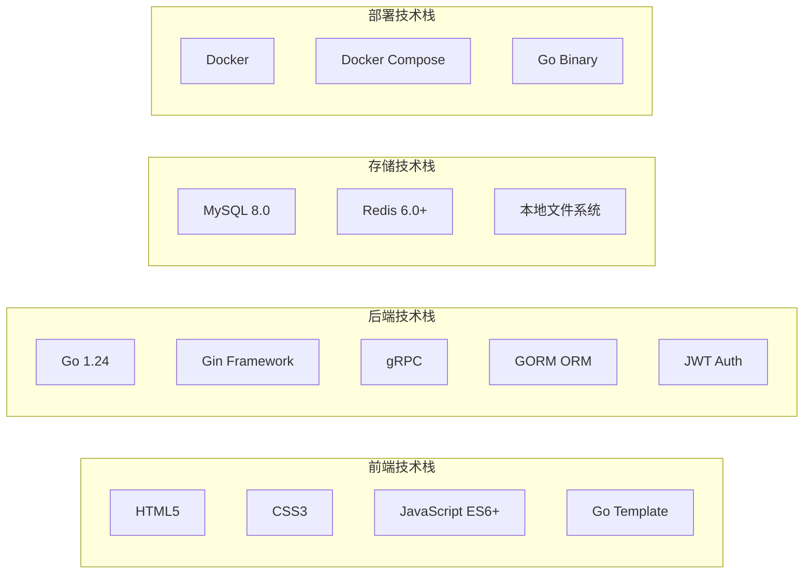

## 2. 架构设计

### 2.1 分层架构

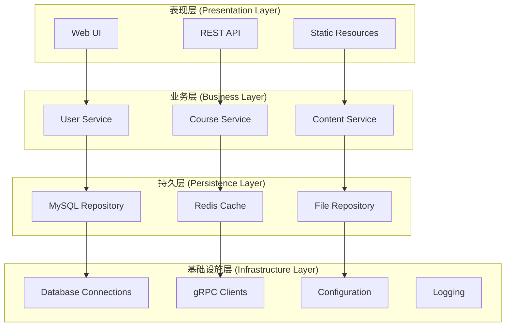

### 2.2 领域驱动设计 (DDD)

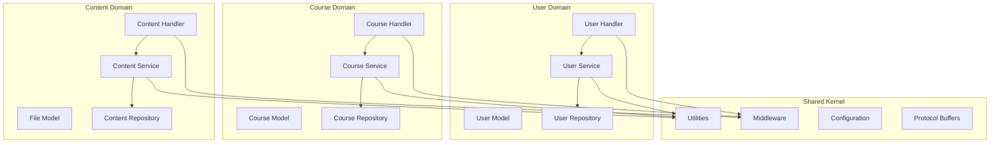

## 3. 微服务详解

### 3.1 服务拆分策略

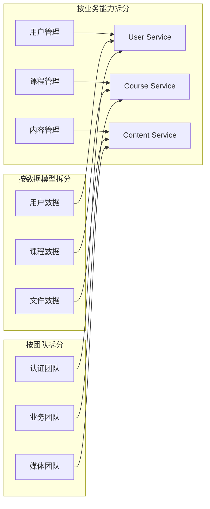

### 3.2 User Service 架构

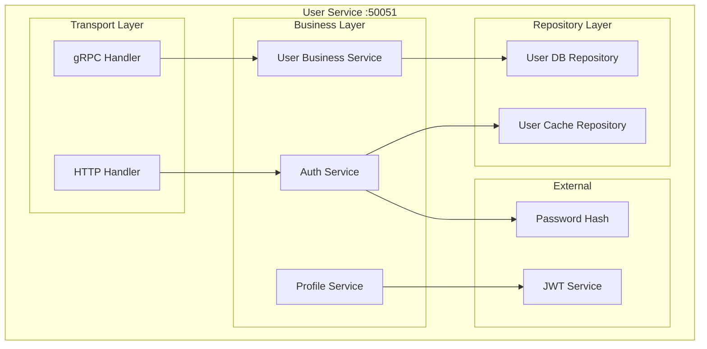

### 3.3 Course Service 架构

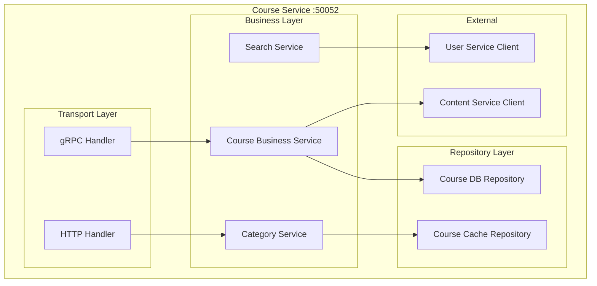

### 3.4 Content Service 架构

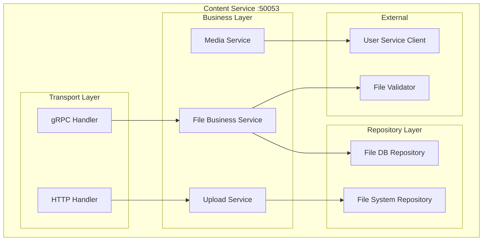

### 3.5 API Gateway 架构

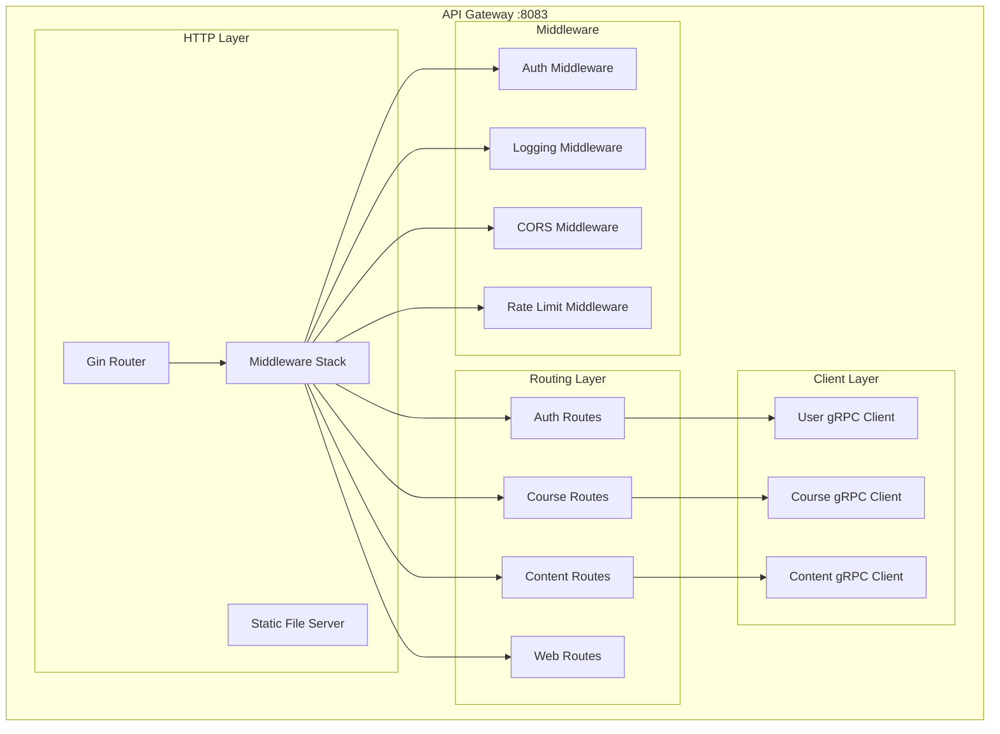

## 4. 数据架构

### 4.1 数据库设计

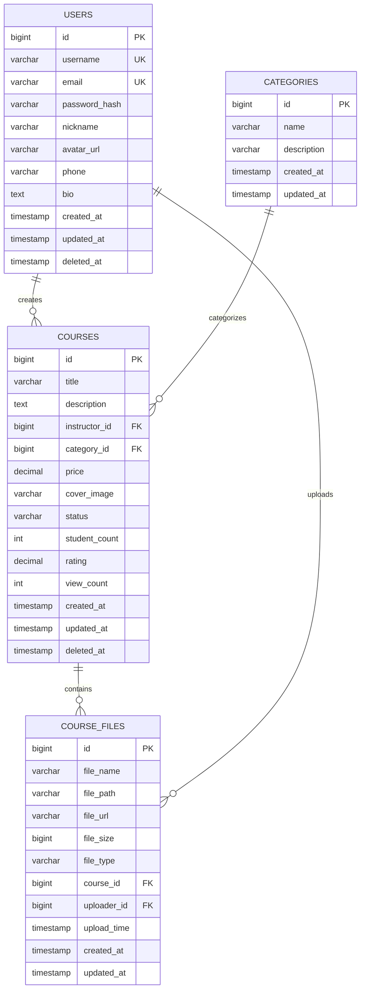

### 4.2 缓存架构

```mermaid
graph TB
    subgraph "Redis 缓存层"
        subgraph "用户缓存"
            UC1[user:profile:{id}]
            UC2[user:session:{token}]
            UC3[user:auth:{email}]
        end
        
        subgraph "课程缓存"
            CC1[course:detail:{id}]
            CC2[course:list:{page}]
            CC3[course:search:{query}]
        end
        
        subgraph "内容缓存"
            FC1[file:meta:{id}]
            FC2[file:list:{course_id}]
        end
        
        subgraph "应用缓存"
            AC1[config:settings]
            AC2[api:rate_limit:{ip}]
        end
    end
    
    subgraph "缓存策略"
        S1[Cache-Aside]
        S2[Write-Through]
        S3[TTL Expiration]
        S4[LRU Eviction]
    end
    
    UC1 --> S1
    CC1 --> S2
    FC1 --> S3
    AC1 --> S4
```

### 4.3 数据一致性策略

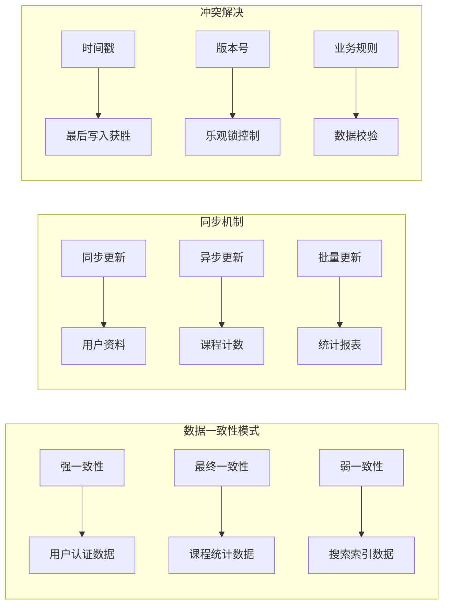

## 5. 通信机制

### 5.1 通信协议架构

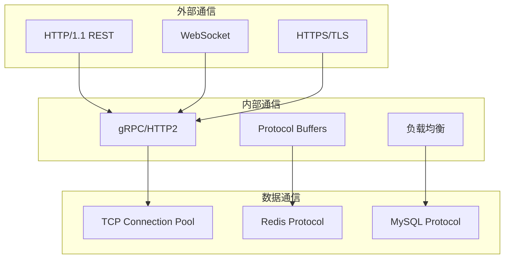

### 5.2 gRPC 服务定义

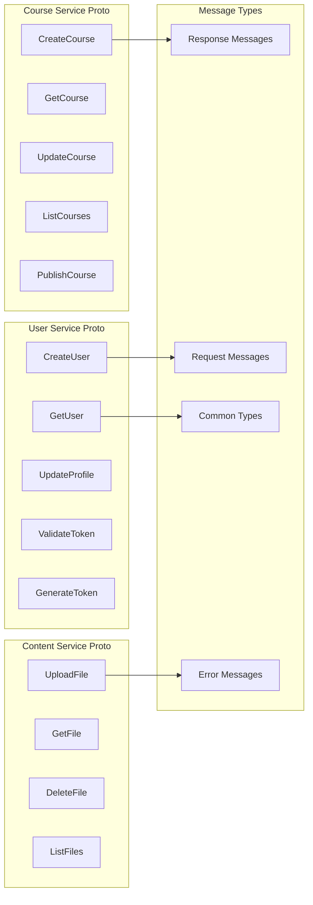

### 5.3 API 路由架构

```mermaid
graph TB
    subgraph "HTTP 路由"
        subgraph "认证路由"
            A1[POST /api/v1/register]
            A2[POST /api/v1/login]
            A3[GET /api/v1/me]
            A4[PUT /api/v1/user/profile]
        end
        
        subgraph "课程路由"
            B1[GET /api/v1/courses]
            B2[POST /api/v1/courses]
            B3[GET /api/v1/courses/:id]
            B4[PUT /api/v1/courses/:id]
            B5[POST /api/v1/courses/:id/publish]
        end
        
        subgraph "内容路由"
            C1[POST /api/v1/content/upload]
            C2[GET /api/v1/content/files]
            C3[DELETE /api/v1/content/files/:id]
        end
        
        subgraph "Web 路由"
            D1[GET /]
            D2[GET /login]
            D3[GET /register]
            D4[GET /dashboard]
            D5[GET /courses/:id]
        end
    end
    
    subgraph "中间件链"
        M1[CORS]
        M2[Logging]
        M3[Authentication]
        M4[Rate Limiting]
    end
    
    A1 --> M1
    B1 --> M2
    C1 --> M3
    D1 --> M4
```

## 6. 部署架构

### 6.1 单机部署架构

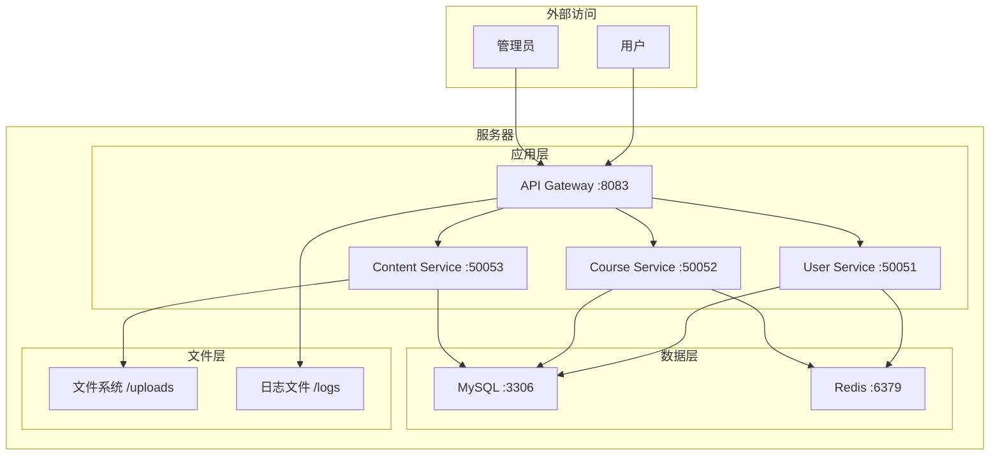

### 6.2 Docker 容器化架构

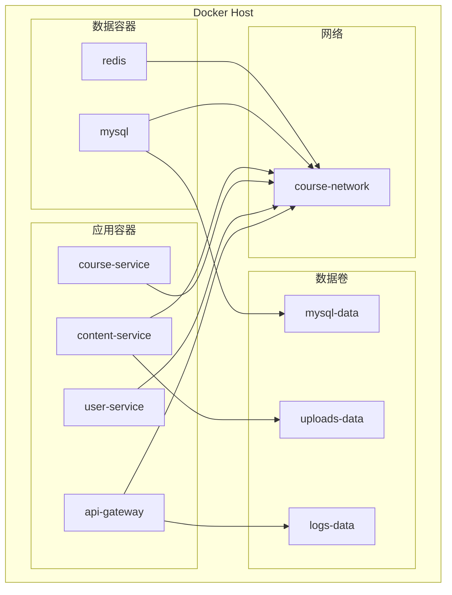

### 6.3 分布式部署架构

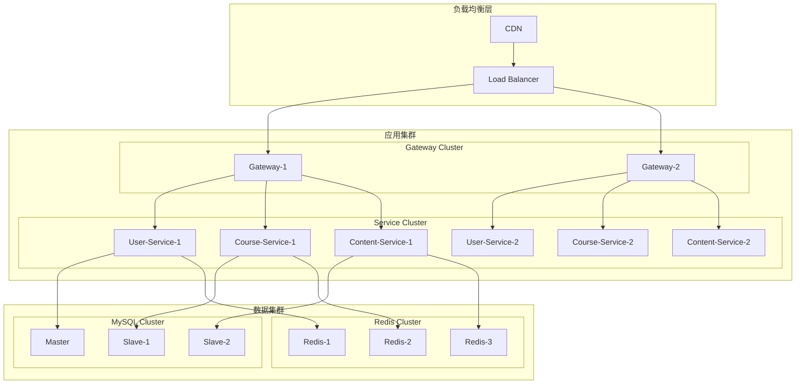

## 7. 安全架构

### 7.1 认证授权架构

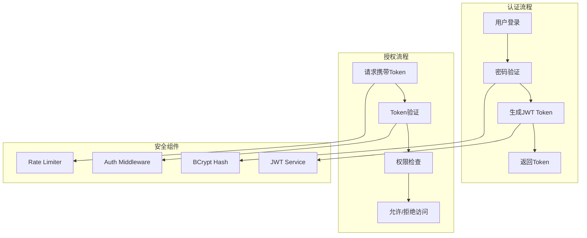

### 7.2 数据安全架构

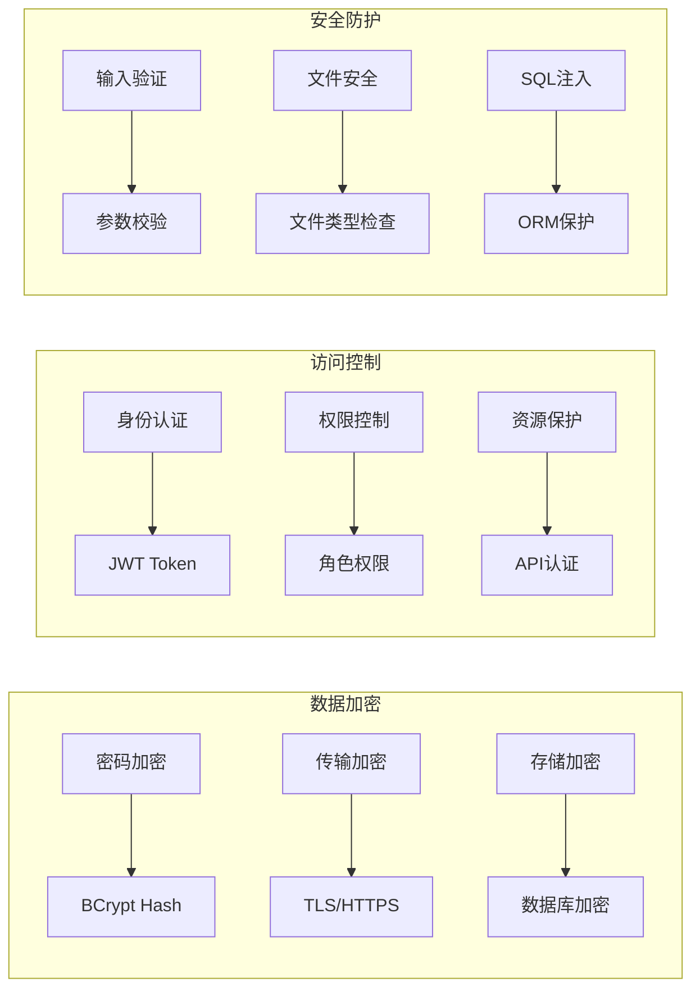

### 7.3 网络安全架构

```mermaid
graph TB
    subgraph "外部防护"
        F1[防火墙]
        F2[DDoS防护]
        F3[WAF]
    end
    
    subgraph "应用防护"
        A1[Rate Limiting]
        A2[CORS Policy]
        A3[Content Security Policy]
    end
    
    subgraph "内部防护"
        I1[gRPC TLS]
        I2[服务间认证]
        I3[网络隔离]
    end
    
    F1 --> A1
    F2 --> A2
    F3 --> A3
    
    A1 --> I1
    A2 --> I2
    A3 --> I3
```

## 8. 文件系统架构

### 8.1 文件存储结构

```mermaid
graph TB
    subgraph "文件系统结构"
        Root[/uploads]
        
        subgraph "用户文件"
            Avatars[/avatars]
            A1[user_123.jpg]
            A2[user_456.png]
        end
        
        subgraph "课程文件"
            Courses[/courses]
            C1[/course_17]
            C2[/course_18]
            
            subgraph "课程17文件"
                Cover1[cover.jpg]
                Videos1[/videos]
                Docs1[/documents]
            end
            
            subgraph "课程18文件"
                Cover2[cover.png]
                Videos2[/videos]
                Docs2[/documents]
            end
        end
        
        subgraph "临时文件"
            Temp[/temp]
            T1[upload_temp_xxx.tmp]
        end
    end
    
    Root --> Avatars
    Root --> Courses
    Root --> Temp
    
    Avatars --> A1
    Avatars --> A2
    
    Courses --> C1
    Courses --> C2
    
    C1 --> Cover1
    C1 --> Videos1
    C1 --> Docs1
    
    C2 --> Cover2
    C2 --> Videos2
    C2 --> Docs2
    
    Temp --> T1
```

### 8.2 文件处理流程

```mermaid
graph TB
    subgraph "文件上传流程"
        U1[接收文件]
        U2[验证文件类型]
        U3[检查文件大小]
        U4[生成文件路径]
        U5[保存到文件系统]
        U6[记录数据库]
        U7[返回文件URL]
    end
    
    subgraph "文件访问流程"
        A1[请求文件URL]
        A2[权限验证]
        A3[查找文件路径]
        A4[读取文件]
        A5[返回文件内容]
    end
    
    U1 --> U2
    U2 --> U3
    U3 --> U4
    U4 --> U5
    U5 --> U6
    U6 --> U7
    
    A1 --> A2
    A2 --> A3
    A3 --> A4
    A4 --> A5
```

### 8.3 文件安全策略

```mermaid
graph LR
    subgraph "上传安全"
        S1[文件类型白名单]
        S2[文件大小限制]
        S3[文件内容扫描]
        S4[路径遍历防护]
    end
    
    subgraph "存储安全"
        T1[目录权限控制]
        T2[文件权限设置]
        T3[定期清理临时文件]
        T4[备份策略]
    end
    
    subgraph "访问安全"
        V1[URL签名验证]
        V2[访问权限检查]
        V3[防盗链保护]
        V4[访问日志记录]
    end
```

## 9. 配置管理

### 9.1 配置架构

```mermaid
graph TB
    subgraph "配置层次"
        Default[默认配置]
        Environment[环境配置]
        Runtime[运行时配置]
        Override[覆盖配置]
    end
    
    subgraph "配置来源"
        File[配置文件]
        EnvVar[环境变量]
        CommandLine[命令行参数]
        Remote[远程配置中心]
    end
    
    subgraph "配置类型"
        App[应用配置]
        DB[数据库配置]
        Cache[缓存配置]
        Security[安全配置]
    end
    
    Default --> Environment
    Environment --> Runtime
    Runtime --> Override
    
    File --> App
    EnvVar --> DB
    CommandLine --> Cache
    Remote --> Security
```

### 9.2 配置文件结构

```yaml
# configs/config.yaml
server:
  port: ":8083"
  mode: "debug"
  read_timeout: "30s"
  write_timeout: "30s"

database:
  mysql:
    host: "localhost"
    port: "3306"
    user: "root"
    password: "123456"
    database: "course_db"
    charset: "utf8mb4"
    max_idle_conns: 10
    max_open_conns: 100
    conn_max_lifetime: "1h"
  
  redis:
    addr: "localhost:6379"
    password: ""
    db: 0
    pool_size: 50
    min_idle_conns: 5

services:
  user_service:
    addr: "localhost:50051"
    timeout: "10s"
  
  course_service:
    addr: "localhost:50052"
    timeout: "10s"
  
  content_service:
    addr: "localhost:50053"
    timeout: "10s"

security:
  jwt:
    secret_key: "your-secret-key"
    expiration: "24h"
  
  upload:
    max_size: "10MB"
    allowed_types: ["image/jpeg", "image/png", "application/pdf"]

logging:
  level: "info"
  format: "json"
  output: "stdout"
  file: "./logs/app.log"
```

## 10. 扩展性设计

### 10.1 水平扩展架构

```mermaid
graph TB
    subgraph "负载均衡扩展"
        LB1[Load Balancer 1]
        LB2[Load Balancer 2]
    end
    
    subgraph "服务扩展"
        subgraph "User Service Pool"
            US1[User Service 1]
            US2[User Service 2]
            US3[User Service 3]
        end
        
        subgraph "Course Service Pool"
            CS1[Course Service 1]
            CS2[Course Service 2]
            CS3[Course Service 3]
        end
        
        subgraph "Content Service Pool"
            CTS1[Content Service 1]
            CTS2[Content Service 2]
            CTS3[Content Service 3]
        end
    end
    
    subgraph "数据扩展"
        subgraph "Database Cluster"
            Master[MySQL Master]
            Slave1[MySQL Slave 1]
            Slave2[MySQL Slave 2]
        end
        
        subgraph "Cache Cluster"
            Redis1[Redis Node 1]
            Redis2[Redis Node 2]
            Redis3[Redis Node 3]
        end
    end
    
    LB1 --> US1
    LB1 --> CS1
    LB1 --> CTS1
    LB2 --> US2
    LB2 --> CS2
    LB2 --> CTS2
    
    US1 --> Master
    CS1 --> Slave1
    CTS1 --> Slave2
    
    US1 --> Redis1
    CS1 --> Redis2
    CTS1 --> Redis3
```

### 10.2 垂直扩展策略

```mermaid
graph LR
    subgraph "计算资源扩展"
        CPU[CPU升级]
        Memory[内存扩容]
        Storage[存储扩容]
    end
    
    subgraph "数据库扩展"
        DB_CPU[数据库CPU优化]
        DB_Memory[数据库内存增加]
        DB_SSD[SSD存储升级]
    end
    
    subgraph "缓存扩展"
        Cache_Memory[缓存内存扩大]
        Cache_Persistence[持久化优化]
        Cache_Cluster[集群模式]
    end
    
    CPU --> DB_CPU
    Memory --> DB_Memory
    Storage --> DB_SSD
    
    DB_CPU --> Cache_Memory
    DB_Memory --> Cache_Persistence
    DB_SSD --> Cache_Cluster
```

### 10.3 功能扩展架构

```mermaid
graph TB
    subgraph "新功能模块"
        Payment[支付服务]
        Notification[通知服务]
        Analytics[分析服务]
        Search[搜索服务]
    end
    
    subgraph "现有核心服务"
        User[用户服务]
        Course[课程服务]
        Content[内容服务]
    end
    
    subgraph "集成方式"
        gRPC_Integration[gRPC集成]
        Event_Bus[事件总线]
        API_Composition[API组合]
    end
    
    Payment --> gRPC_Integration
    Notification --> Event_Bus
    Analytics --> API_Composition
    Search --> gRPC_Integration
    
    gRPC_Integration --> User
    Event_Bus --> Course
    API_Composition --> Content
```

---

## 总结

Course Platform 采用了现代化的微服务架构设计，具有以下特点：

### 优势
1. **模块化设计**：每个服务职责单一，便于开发和维护
2. **技术栈统一**：全栈Go语言，降低学习成本
3. **扩展性强**：支持水平和垂直扩展
4. **部署灵活**：支持单机和分布式部署
5. **安全可靠**：多层安全防护机制

### 适用场景
- 中小型在线教育平台
- 企业内训系统
- 知识付费平台
- 技能培训机构

### 未来演进方向
- 服务网格集成
- 事件驱动架构
- 云原生部署
- AI功能集成

这个架构设计为Course Platform提供了稳定的技术基础，支持业务的快速发展和技术的持续演进。 